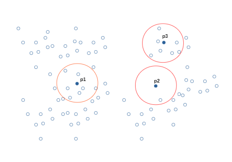

# CUDA-NearestPoints
Implementation in CUDA for finding S points from a K point subset of C (which has all points) that have a minimum of T nearest points in their vicinity, at a maximum distance of d_m euclidean units.
## Example Diagram

\
where we can see that given:
* A = {p1,p2,p3} a subset of three points (K = 3)
* T = 8 
* d_m = unknown
\
The S solution set is S = {p1,p3} (it includes itself while counting for T).
